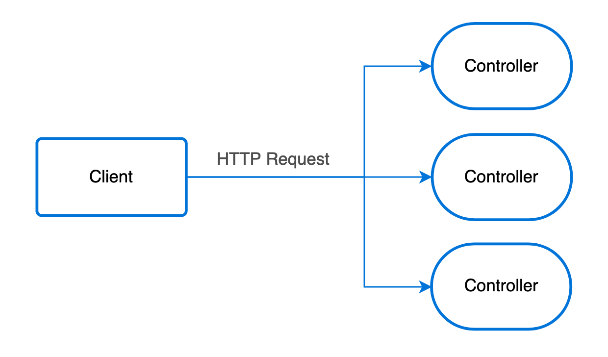

---
meta:
 - name: description
   content: Documentation over Controllers provided by Ts.ED framework. Use controllers to build your REST API.
 - name: keywords
   content: controllers ts.ed express typescript node.js javascript decorators jsonschema class models
---
# Controllers

Controllers are responsible for handling incoming **requests** and returning **responses** to the client.

<figure></figure>

A controller is here to handle a specific request for a given HTTP verb and Route. The routing service is responsible to
manage and dispatch request to the right Controller.

In order to create a basic controller, we use classes and **decorators**. Decorators associate classes with required metadata and enable Ts.ED to create a routing map.

## Routing

### Usage

In the following example we'll use the @@Controller@@ decorator which is required to define a basic controller.
 We'll specify a path for the controller which will be used by the routing mechanism to create your routes.

<<< @/docs/docs/snippets/controllers/basic-controller.ts

The @@Get@@ decorator before the `findAll()` method tells Ts.ED to create an endpoint for this particular route path and 
map every corresponding request to this handler. Since we've declared a prefix for every route (`/calendars`), Ts.ED will map every `GET /calendars` request to this method.

Ts.ED provide a decorator for each HTTP verb which can be use to handle a request:

<ApiList query="['All', 'Get', 'Post', 'Patch', 'Put', 'Head', 'Delete'].indexOf(symbolName) > -1" />

### Configuration

You can add your controller by adding glob pattern on `mount` ServerSettings attributes or by importing manually your controller.
Here an example:

<<< @/docs/docs/snippets/controllers/routing.ts

### Create multiple version of your API 

As you have seen in the previous example, the `mount` attribute is an object that let you to provide the global endpoint for your all controllers under the `controllers` folder.

You can add more configuration to mount different endpoint associated to a folder. Here is another configuration example:

<<< @/docs/docs/snippets/controllers/routing-with-version.ts

### Async and Promise

Ts.ED support Promise and `async` instruction to send a response. Just return a promise
in your method and the controller will be waiting for your promised response before
sending a response to the client.

<<< @/docs/docs/snippets/controllers/async-controller.ts

### Multiple endpoint, single method

Ts.ED let you define multiple endpoint on the same method, with same verb like `GET` or `POST`, or with another
verb like this:

<<< @/docs/docs/snippets/controllers/multiple-endpoint-single-method.ts

### Routes order

Be aware that routes registration order (methods order in classes) matters. 
Assume that you have a route that allows getting calendars by his path (`/calendars/:id`). 
If you register another endpoint below the mentioned one, which basically returns all calendars at once (calendars), 
the request will never hit the actual handler because all path parameters are optional.
 
See the following example:

<<< @/docs/docs/snippets/controllers/routes-order.ts

In order to avoid such side-effects, simply move `findAll()` method above `findOne()`.

## Request
### Input parameters

@@PathParams@@ decorator provide quick access to an attribute `Express.request.params`.

<<< @/docs/docs/snippets/controllers/input-path-parameters.ts

Same decorator is available to get other params. Use these decorators to get parameters send by the client:

- @@BodyParams@@
- @@PathParams@@
- @@QueryParams@@

### Headers

@@HeaderParams@@ decorator provide you a quick access to the `Express.request.get()`

<<< @/docs/docs/snippets/controllers/request-headers.ts

### Session/Cookies/Locals

For the session, cookies or locals data attached on the request, is the same thing seen as previously. Use the following decorators to get the data:

- @@Session@@
- @@Cookies@@
- @@Locals@@

## Response

### Decorators

<ApiList query="['All', 'Get', 'Post', 'Patch', 'Put', 'Head', 'Delete', 'Use', 'UseAfter', 'UseBefore'].indexOf(symbolName) === -1 && path.indexOf('mvc/decorators/method') > -1" />

### Status

You can change the default response status with the @@Status@@ decorator:

<<< @/docs/docs/snippets/controllers/response-status.ts

### Content Type

You can set the response content type with the @@ContentType@@ decorator:

<<< @/docs/docs/snippets/controllers/response-content-type.ts

### Header

You can set the response header with the @@Header@@ decorator:

<<< @/docs/docs/snippets/controllers/response-headers.ts

### Throw exceptions

You can use [ts-httpexceptions](https://github.com/TypedProject/ts-httpexceptions) or similar module to throw an http exception.
All exception will be intercepted by the [Global error handler](/docs/middlewares/override/global-error-handler.md)
and are sent to the client.

Here an example:

<<< @/docs/docs/snippets/controllers/response-throw-exceptions.ts

::: tip
This example will produce a response with status code 400 and "Not a number" message. 
@@GlobalErrorHandlerMiddleware@@ will catch and format the error before sending it to the client.
:::

::: tip
See our guide on [HttpExceptions to throw customer HttpExceptions](/tutorials/throw-http-exceptions.md)
:::

## Inject request, response and next

You can use a decorator to inject `Express.Request`, `Express.Response` and
`Express.NextFunction` services instead of the classic call provided by Express API.

- @@Req@@
- @@Res@@
- @@Next@@

Here an example to use these decorators:

<<< @/docs/docs/snippets/controllers/raw-req-res-next.ts

## Inject router

Each controller has an [Express.Router](http://expressjs.com/en/guide/routing.html) instance associated with it.
The [ExpressRouter](/api/common/mvc/services/ExpressRouter.md) decorator is here to inject this instance into your controller.

<<< @/docs/docs/snippets/controllers/handle-router-controller.ts

::: warning
In this case, injection on the method isn't available.
:::

## Advanced usage
### Templating

Template feature depending on the engine rendering use by your application. Ts.ED provide decorator @@Render@@ to define a view which will be used
by the Endpoint to generate the response.

Here an example of a controller which use the @@Render@@ decorator:

<<< @/docs/docs/snippets/controllers/response-templating.ts

And his view:

```html
<h1><%- name %></h1>
<div>
    Start: <%- startDate %>
</div>
```

::: tip
See our guide to [install the engine rendering](/tutorials/templating.md) with Ts.ED.
:::

### Middlewares

The middleware is a function which is called before the route handler. 
Middleware functions have access to the request and response objects, and the next middleware function in the application’s request-response cycle. 
The next middleware function is commonly denoted by a variable named next.

::: tip
For more details about Middleware declaration see the [Middlewares](/docs/middlewares.md) section.
:::

The following decorators lets you add custom middleware on a method or on controller:

<ApiList query="['Use', 'UseBefore', 'UseAfter'].indexOf(symbolName) > -1" />

#### Example

<<< @/docs/docs/snippets/controllers/middlewares.ts


#### Middleware call sequence

When a request is sent to the server all middlewares added on the ServerLoader, Controller or Endpoint
 will be called while a response isn't sent by one of the middleware in the lifecycle.

<figure></figure>

::: tip
See [middleware call sequence](/docs/middlewares/call-sequence.md) for more information.
:::

### Child controllers

A controller can have one or more child controller. This feature allows you to combine your controllers with each other to define your routes. 
One controller can be added to multiple controllers, so you can easily reuse the same controller.

<<< @/docs/docs/snippets/controllers/child-controllers.ts

This example will produce these following routes:

Verb | Route | Method
---|---|---
GET | `/rest` | `RestCtrl.get()`
GET | `/rest/calendars` | `CalendarCtrl.get()`
GET | `/rest/calendars/events` | `EventCtrl.get()`
GET | `/rest/events` | `EventCtrl.get()`

### Merge Params

In some case you need to have a complex routes like this `rest/calendars/:calendarId/events/:eventId`.
This route can be written with Ts.ED like this :

<<< @/docs/docs/snippets/controllers/merge-params-1.ts

In this case, the calendarId will be `undefined` because `Express.Router` didn't merge params by
default from the parent `Router` (see [Express documentation](http://expressjs.com/fr/api.html#express.router)).

To solve it you can use the @@MergeParams@@ decorator. See example:

<<< @/docs/docs/snippets/controllers/merge-params-2.ts

> Now, calendarId will have the value given in the context path.

::: tip
`caseSensitive` and `strict` options are also supported with his respective decorators @@CaseSensitive@@ and @@Strict@@.
:::

### Inheritance

Ts.ED support the ES6 inheritance class. So you can declare a controller that implement some generic method
and use it on a children class.


To do that just declare a parent controller without the @@Controller@@ decorator.

<<< @/docs/docs/snippets/controllers/inheritance-base-controller.ts

Then, on your children controller:

<<< @/docs/docs/snippets/controllers/inheritance-child-controller.ts

## Decorators

<ApiList query="module == '@tsed/common' && symbolType === 'decorator' && (path.indexOf('common/mvc') > -1 || path.indexOf('common/filters') > -1)" />
