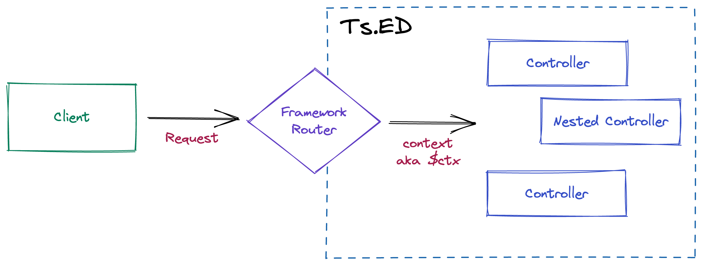

---
meta:
  - name: description
    content: Documentation over Controllers provided by Ts.ED framework. Use controllers to build your REST API.
  - name: keywords
    content: controllers ts.ed express typescript node.js javascript decorators jsonschema class models
---

# Controllers

Controllers are responsible for handling incoming **requests** and returning **responses** to the client.

<figure></figure>

A controller is here to handle a specific request for a given HTTP verb and Route. The routing service is responsible for
managing and dispatching request to the right Controller.

In order to create a basic controller, we use classes and **decorators**. Decorators associate classes with required metadata and enable Ts.ED to create a routing map.

## Routing

### Usage

In the following example we'll use the @@Controller@@ decorator which is required to define a basic controller.
We'll specify a path for the controller which will be used by the routing mechanism to create your routes.

<<< @/docs/snippets/controllers/basic-controller.ts

The @@Get@@ decorator before the `findAll()` method tells Ts.ED to create an endpoint for this particular route path and
map every corresponding request to this handler. Since we've declared a prefix for every route (`/calendars`), Ts.ED will map every `GET /calendars` request to this method.

### Decorators

Ts.ED provides a decorator for each HTTP verb which can be used to handle a request:

<ApiList query="tags:decorator AND tags:httpMethod" />

Other decorators are provided to describe your route with OpenSpec, adding middlewares, adding some constraints or adding headers:

<ApiList query="status.includes('decorator') && status.includes('operation') && !status.includes('input') && !status.includes('httpMethod')" />

### Configuration

You can add your controller by adding glob pattern on `mount` ServerSettings attributes or by importing manually your controller.
Here an example:

<<< @/docs/snippets/controllers/routing.ts

### Create multiple versions of your API

As you have seen in the previous example, the `mount` attribute is an object that let you provide the global endpoint for all your controllers under the `controllers` folder.

You can add more configurations to mount different endpoints associated to a folder. Here is another configuration example:

<<< @/docs/snippets/controllers/routing-with-version.ts

### Async and Promise

Ts.ED works well with Promise and `async` function.
Every async function has to return a `Promise`.
This means that you can return a deferred value that Ts.ED will be able to resolve by itself.

Let's see an example of this:

<<< @/docs/snippets/controllers/async-controller.ts

### Observable/Stream/Buffer

Also, Ts.ED support function that return `Observable`, `Stream` or `Buffer`.

<<< @/docs/snippets/controllers/observable-stream-buffer-controller.ts

### Axios response

Sometime, you just want call another API to proxy a webservice.
Axios is an excellent library to call API in Node.js and Ts.ED is able to handle Axios response to wrap it into an Express.js response.

<<< @/docs/snippets/controllers/axios-controller.ts

### Multiple endpoints, single method

Ts.ED lets you define multiple endpoints on the same method, with the same verb like `GET` or `POST`, or with another
verb like this:

<<< @/docs/snippets/controllers/multiple-endpoint-single-method.ts

### Routes order

Be aware that routes registration order (methods order in classes) matters.
Assume that you have a route that allows getting a calendar by its path (`/calendars/:id`).
If you register another endpoint below the mentioned one, which basically returns all calendars at once (calendars),
the request will never hit the actual handler because all path parameters are optional.

See the following example:

<<< @/docs/snippets/controllers/routes-order.ts

In order to avoid such side-effects, simply move `findAll()` method above `findOne()`.

## Request

### Decorators

<ApiList query="status.includes('decorator') && status.includes('operation') && status.includes('input')" />

### Input parameters

Getting parameters from Express Request can be done by using the following decorators:

- @@BodyParams@@: `Express.request.body`
- @@RawBodyParams@@: `Express.request.rawBody`
- @@PathParams@@: `Express.request.params`
- @@RawPathParams@@: `Express.request.params` without transformation and validation,
- @@QueryParams@@: `Express.request.query`
- @@RawQueryParams@@: `Express.request.query` without transformation and validation,

<Tabs class="-code">
  <Tab label="Example">

<<< @/docs/snippets/controllers/params-decorator.ts

  </Tab>
  <Tab label="Body string">

<<< @/docs/snippets/controllers/params-post-string.ts

  </Tab> 
  <Tab label="Body with Array">

<<< @/docs/snippets/controllers/params-post-array.ts

  </Tab> 
  <Tab label="Body with model">

<<< @/docs/snippets/controllers/params-post-array-with-model.ts

  </Tab>
  <Tab label="Inline validation">

<<< @/docs/snippets/controllers/params-post-inline-validation.ts

  </Tab>  
</Tabs>

Finally, @@BodyParams@@ accepts to give a @@ParamOptions@@ object as parameter to change the decorator behavior:

<<< @/docs/snippets/controllers/params-advanced-usage.ts

::: tip
Since v5.51.0+, @@QueryParams@@ decorator accept a model to transform `Express.request.query` plain object to a Class.

```typescript
import {Controller, Get, QueryParams} from "@tsed/common";
import {Required, MinLength, Property} from "@tsed/schema";

class QueryParamsModel {
  @Required()
  @MinLength(1)
  name: string;

  @Property()
  duration: number;
}

@Controller("/")
class QueryController {
  @Get("/")
  get(@QueryParams() params: QueryParamsModel, @QueryParams("locale") locale: string) {}
}
```

:::

::: warning

Since v6.0.0, use `any` as type for a body parameter, will be translated as type `Object`. It means, if you use `@tsed/ajv`, the validation
will fail if you send a different type as expected in the payload.

<<< @/docs/snippets/controllers/params-post-any.ts

Add @@Any@@ decorator to fix the issue.

:::

### Raw Body <Badge text="v6.20.0+" />

@@RawBodyParams@@ decorator provides you quick access to the `request.rawBody`:

<<< @/docs/snippets/controllers/request-raw-body.ts

::: warning
There is no performed input validation and deserialization when using the @@RawBodyParams@@!
:::

::: warning
To use @RawBodyParams() properly, you have to remove bodyParser add on `$beforeRoutesInit`.

```diff

@Configuration({
+  middlewares: [
+     bodyParser.json(),
+     bodyParser.urlencoded({extended: true})
+  ]
})
export class Server {
  @Inject()
  protected app: PlatformApplication;

  $beforeRoutesInit() {
-    this.app
-      .use(bodyParser.json())
-      .use(bodyParser.urlencoded({extended: true}));
  }
}
```

:::

### Headers

@@HeaderParams@@ decorator provides you quick access to the `request.get()`:

<<< @/docs/snippets/controllers/request-headers.ts

### Session/Cookies/Locals/Context

For the session, cookies, locals or context data attached on the request, it works the same way as seen before. Use the following decorators to get the data:

- @@Session@@
- @@Cookies@@
- @@Locals@@
- @@Context@@

#### Locals

@@Locals@@ is a response property used by third-party like template engine to render a page by the server.
If you attach data on it, template engine will use it to render the template.

Here is an example:

<<< @/docs/snippets/controllers/locals-example.ts

#### Context

See our dedicated page on [PlatformContext](/docs/request-context.md) for more details.

#### Validation

Ts.ED support the data input validation with the decorators provided by `@tsed/schema`.

Example:

<<< @/docs/snippets/controllers/request-input-validation.ts

::: warning
Validation require the `@tsed/ajv` plugins to work.

```sh
npm install --save @tsed/ajv
```

:::

**Supported decorators:**

<ApiList query="module === '@tsed/schema' && status.includes('decorator') && status.includes('schema') && !status.includes('operation') && !['Property'].includes(symbolName)" />

## Response

### Decorators

<ApiList query="status.includes('decorator') && status.includes('operation') && status.includes('response')" />

### Status

You can change the default response status with the @@Status@@ decorator:

<<< @/docs/snippets/controllers/response-status.ts

### Content Type

You can set the response content type with the @@ContentType@@ decorator:

<<< @/docs/snippets/controllers/response-content-type.ts

### Header

You can set the response header with the @@Header@@ decorator:

<<< @/docs/snippets/controllers/response-headers.ts

### Redirect

Redirects to the URL derived from the specified path, with specified status, a positive integer that corresponds to an HTTP status code . If not specified, status defaults to “302 “Found”.

```typescript
@Controller("/")
class MyCtrl {
  @Redirect("/foo/bar")
  @Redirect(301, "http://example.com")
  myMethod() {}
}
```

Redirects can be a fully-qualified URL for redirecting to a different site:

```typescript
@Controller("/")
class MyCtrl {
  @Redirect("http://google.com")
  myMethod() {}
}
```

Redirects can be relative to the root of the host name. For example, if the application is on http://example.com/admin/post/new, the following would redirect to the URL http://example.com/admin:

```typescript
@Controller("/")
class MyCtrl {
  @Redirect("/admin")
  myMethod() {}
}
```

Redirects can be relative to the current URL. For example, from http://example.com/blog/admin/ (notice the trailing slash), the following would redirect to the URL http://example.com/blog/admin/post/new.

```typescript
@Controller("/")
class MyCtrl {
  @Redirect("post/new")
  myMethod() {}
}
```

Redirecting to post/new from http://example.com/blog/admin (no trailing slash), will redirect to http://example.com/blog/post/new.

If you found the above behavior confusing, think of path segments as directories (with trailing slashes) and files, it will start to make sense.

Path-relative redirects are also possible. If you were on http://example.com/admin/post/new, the following would redirect to http//example.com/admin/post:

```typescript
@Controller("/")
class MyCtrl {
  @Redirect("..")
  myMethod() {}
}
```

A back redirection redirects the request back to the referer, defaulting to / when the referer is missing.

```typescript
class MyCtrl {
  @Redirect("back")
  myMethod() {}
}
```

Finally, it also possible to perform redirection programmatically:

```typescript
import {Controller, Get, ctx} from "@tsed/common";

@Controller("/")
class MyCtrl {
  @Get("/")
  myMethod(@Context() ctx: Context) {
    return ctx.response.redirect("/path/to");
  }
}
```

### Generics

One of the new usage allowed by the @@Returns@@ is the support of the Generics from TypeScript.

This feature is basically there to meet the need to generate correct Swagger documentation when using generic templates.

For example, you want to return a generic `Document` payload which contains a data (Product) and links to allow a commuter to discover your endpoints linked to this data.

With @@Returns@@ you can document correctly your endpoint to reflect the correct model:

<Tabs class="-code">
  <Tab label="MyController.ts" icon="bx-code-alt">

<<< @/docs/snippets/controllers/response-generics-controller.ts

  </Tab>
  <Tab label="Document.ts" icon="bx-code-alt">

<<< @/docs/snippets/controllers/response-generics-document.ts

  </Tab>  
  <Tab label="Product.ts" icon="bx-code-alt">

<<< @/docs/snippets/controllers/response-generics-product.ts

  </Tab>
  <Tab label="CodeSandbox" icon="bxl-codepen">

<iframe src="https://codesandbox.io/embed/tsed-swagger-example-ripfl?fontsize=14&hidenavigation=1&theme=dark"
     style="width:100%; height:500px; border:0; border-radius: 4px; overflow:hidden;"
     title="tsed-swagger-example"
     allow="accelerometer; ambient-light-sensor; camera; encrypted-media; geolocation; gyroscope; hid; microphone; midi; payment; usb; vr; xr-spatial-tracking"
     sandbox="allow-forms allow-modals allow-popups allow-presentation allow-same-origin allow-scripts"></iframe>
     
  </Tab>
</Tabs>

### Throw exceptions

You can use [@tsed/exceptions](/docs/exceptions.md) or similar module to throw an http exception.
All exception will be intercepted by the [Global error handler](/docs/middlewares/override/global-error-handler.md)
and are sent to the client.

Here is an example:

<<< @/docs/snippets/controllers/response-throw-exceptions.ts

::: tip
This example will produce a response with status code 400 and "Not a number" message.
@@GlobalErrorHandlerMiddleware@@ will catch and format the error before sending it to the client.
:::

::: tip
See our guide on [HttpExceptions to throw customer HttpExceptions](/docs/throw-http-exceptions.md)
:::

## Inject Request and Response

You can use a decorator to inject the Request in order to retrieve information from the request that you cannot get through decorators.
In the same way you can inject the Response instance in order to modify some of its information.

This is not recommended, however, because your will potentially be specific to the platform you are using (Express.js, Koa.js, etc ...)

You can with the Req and Request decorators retrieve the originals request and response as follows:

<<< @/docs/snippets/controllers/inject-req-res-target.ts

It's also possible to inject the high level PlatformRequest and PlatformResponse:

<<< @/docs/snippets/controllers/inject-req-res-platform.ts

Finally, it is also possible to retrieve the request and response in Node.js version:

<<< @/docs/snippets/controllers/inject-req-res-node.ts

## Inject next

Use @@Next@@ decorator isn't recommended because Ts.ED use Promise/Observable to return a response, but something it's required to get next function
to chain middlewares.

<<< @/docs/snippets/controllers/inject-next.ts

## Inject router

Each controller has a @@PlatformRouter@@ which wrap the original router from [Express.Router](http://expressjs.com/en/guide/routing.html
or KoaRouter.
You can inject @@PlatformRouter@@ in your controller to add anything related to the current Router controller.

<<< @/docs/snippets/controllers/inject-router.ts

::: warning
All of these routes added by this way won't be discovered by Ts.ED to produce Swagger documentation.
:::

## Templating

A template engine like [EJS](https://ejs.co/) or [Handlebars](https://handlebarsjs.com/) can be used to change the response returned by your endpoint.
Like Express.js, you need to configure the templating engine so that you can use it later with the @@View@@ decorator.

Here is an example of a controller which uses the @@View@@ decorator:

<<< @/docs/snippets/templating/response-templating.ts

And its view:

```html
<h1><%- name %></h1>
<div>Start: <%- startDate %></div>
```

::: tip
To configure a template engine with Ts.ED, see our guide to [install the engine rendering](/tutorials/templating.md) with Ts.ED.
:::

## Middlewares

The middleware is a function which is called before the route handler.
Middleware functions have access to the request and response objects, and the next middleware function in the application’s request-response cycle.
The next middleware function is commonly denoted by a variable named next.

::: tip
For more details about Middleware declaration see the [Middlewares](/docs/middlewares.md) section.
:::

The following decorators lets you add custom middleware on a method or on controller:

<ApiList query="['Use', 'UseBefore', 'UseAfter', 'UseBeforeEach'].indexOf(symbolName) > -1" />

### Example

<<< @/docs/snippets/controllers/middlewares.ts

### Middleware call sequence

When a request is sent to the server all middlewares added on the Server, Controller or Endpoint
will be called while a response isn't sent by one of the middleware in the lifecycle.

<figure></figure>

::: tip
See [middlewares section](/docs/middlewares.md) for more information.
:::

## Nested controllers

A controller can have one or more nested controllers. This feature allows you to combine your controllers with each other to define your routes.
One controller can be added to multiple controllers, so you can easily reuse the same controller.

<Tabs class="-code">
  <Tab label="RestCtrl.ts">

<<< @/docs/snippets/controllers/child-controllers-rest.ts

  </Tab>
  <Tab label="CalendarCtrl.ts">

<<< @/docs/snippets/controllers/child-controllers-calendar.ts

  </Tab>  
  <Tab label="EventCtrl.ts">

<<< @/docs/snippets/controllers/child-controllers-event.ts

  </Tab>
  <Tab label="Server.ts">

<<< @/docs/snippets/controllers/child-controllers-server.ts

  </Tab>      
</Tabs>

This example will produce these following routes:

| Verb | Route                    | Method                |
| ---- | ------------------------ | --------------------- |
| GET  | `/rest`                  |  `RestCtrl.get()`     |
| GET  | `/rest/calendars`        |  `CalendarCtrl.get()` |
| GET  | `/rest/calendars/events` |  `EventCtrl.get()`    |
| GET  | `/rest/events`           |  `EventCtrl.get()`    |

## Inheritance

Ts.ED supports the ES6 inheritance class. So you can declare a controller that implement some generic method
and use it on a children class.

To do that just declare a parent controller without the @@Controller@@ decorator.

<<< @/docs/snippets/controllers/inheritance-base-controller.ts

Then, on your child controller:

<<< @/docs/snippets/controllers/inheritance-child-controller.ts

## Decorators

<ApiList query="tags: decorator AND operation OR controller"/>
