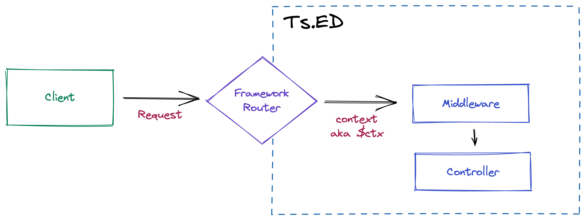
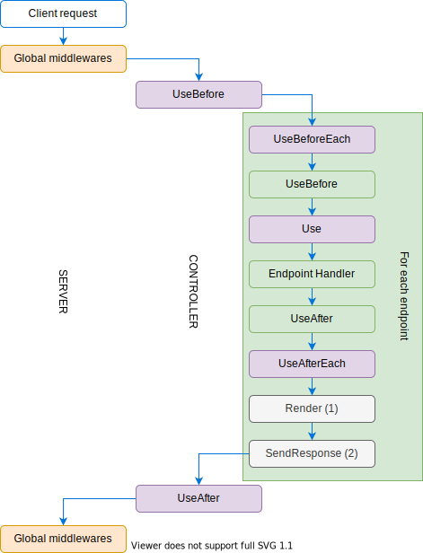

# Middlewares

@@Middleware@@ is similar to the Express middleware with the difference that it's a class and you can use the IoC
to inject other services on its constructor.

All middlewares decorated by @@Middleware@@ have one method named `use()`.
This method can use all parameters decorators as you can see with the [Controllers](/docs/controllers.md) and return a promise.

<figure></figure>

## Configuration

To begin, you must add the `middlewares` folder to the `componentsScan` attribute in your server settings as follows:

<<< @/docs/snippets/middlewares/server-configuration.ts

Then, create a new file in your middlewares folder. Create a new Class definition and then add the @@Middleware@@ decorator.

<<< @/docs/snippets/middlewares/middleware-example.ts

There are different use cases for declaring and using middleware, as follows:

- [Global middleware](/docs/middlewares.html#global-middleware): this middleware can be used on the Server,
- [Endpoint middleware](/docs/middlewares.html#endpoint-middleware): this middleware can be used on a controller method,
- [Error middleware](/docs/middlewares.html#error-middleware): this middleware can be used to handle errors.

::: tip Note
Global middleware and endpoint middleware are similar, except that the Endpoint middleware
can access the last executed endpoint information.
:::

## Global middleware

Global middlewares are generally used to handle requests before or after controllers.

<<< @/docs/snippets/middlewares/global-middleware.ts

Then add your middleware to the Server by using the right hook:

<<< @/docs/snippets/middlewares/global-middleware-configuration.ts

It's also possible to register middlewares using `middlewares` option in the @@Configuration@@ decorator.
In addition, it's also possible to configure the environment for which the middleware should be loaded.

```typescript
import {Configuration, ProviderScope, ProviderType} from "@tsed/di";

@Configuration({
  middlewares: [
    {hook: "$afterInit", use: helmet({contentSecurityPolicy: false})},
    {env: Env.PROD, use: EnsureHttpsMiddleware},
    cors(),
    cookieParser(),
    compress({}),
    methodOverride(),
    AuthTokenMiddleware
  ]
})
export class Server {}
```

The middlewares added through `middlewares` option will always be registered after the middlewares registered through the hook methods!

::: warn
Only Express/Koa middlewares can be added to `$beforeInit`, `$onInit` and `$afterInit` hooks. At this step the PlatformContext is not available. Injectable Ts.ED middleware won't work as expected.
To add Ts.ED middleware, use the `$beforeRoutesInit` hook (it's the default hook value) or leave the `hook` property empty.
:::

## Endpoint middleware

Endpoint middleware is not really different from global middleware, but its goal is to handle a request before or after an endpoint.
It knows which endpoint is executed by using the @@EndpointInfo@@ decorator.

The following example shows you how to implement the middleware and use it with a custom decorator.

<Tabs class="-code">
  <Tab label="AcceptMimesMiddleware.ts">
  
<<< @/docs/snippets/middlewares/endpoint-middleware.ts

  </Tab>
  <Tab label="accept.ts">
    
<<< @/docs/snippets/middlewares/endpoint-middleware-decorator.ts
   
  </Tab>
  <Tab label="Usage">

<<< @/docs/snippets/middlewares/endpoint-middleware-usage.ts

  </Tab>
</Tabs>
  
Middleware can be used on a class controller or an endpoint method with the following decorators:

- @@UseBefore@@
- @@Use@@
- @@UseAfter@@
- or routes decorators: @@Get@@, @@Post@@, @@Delete@@, @@Put@@ and @@Patch@@

<<< @/docs/snippets/middlewares/endpoint-use-decorator-usage.ts

::: tip
If your middleware isn't correctly placed in the call sequence, you can use the `priority` property to change the order.

```ts
@Middleware({
  priority: -1
})
class MyMiddleware {}
```

Note: This option is only available for middlewares added to a controller or endpoint method.

:::

## Error middleware

Express allows you to handle any error when your middleware has 4 parameters like this:

```javascript
function (error, req, res, next){}
```

Ts.ED has the same mechanism with the @@Err@@ decorator. Use this decorator on a middleware to create a handler which will only be called when an error occurs on the decorated endpoint.

```typescript
import {Err, Middleware, Next} from "@tsed/common";

@Middleware()
export class MyMiddlewareError {
  use(@Err() err: unknown, @Next() next: Next) {
    console.log("===> Error:", err);
  }
}
```

The following example is the GlobalErrorHandlerMiddleware
used by Ts.ED to handle all errors thrown by your application.

If you plan to catch errors globally see our [Exception filter](/docs/exceptions.md) page.

## Specifics parameters decorators

In addition, you have these specific parameters decorators for the middlewares:

| Signature   | Description                                       |
| ----------- | ------------------------------------------------- |
| @@Err@@     | Inject the `Express.Err` service.                 |
| @@Context@@ | Provide all information about the called endpoint |

## Call sequences

As you saw in the previous section, a middleware can be used in different contexts:

- [Server](/docs/configuration.md),
- [Controller](/docs/controllers.md),
- [Endpoint](/docs/controllers.md).

A middleware added to a controller or endpoint level has the same constraint as the endpoint method itself.
It will be executed only when the url request matches with the path associated with the controller and its endpoint method.

When a request is sent to the server all middlewares added at the Server, [Controller](/docs/controllers.md) or Endpoint level with decorators
will be called until one of the handlers/middlewares in the stack sends a response.

<figure></figure>

For each executed endpoints and middlewares, Platform API stores the return value in the @@Context@@. We have two scenarios:

1. If data is stored in the @@Context@@ object, the response will be immediately sent to your consumer after the UseAfterEach middleware (if present).
2. If no data is stored in the @@Context@@ object, the call sequence middlewares continue to the next endpoint (if present) or to the UseAfter then Global middlewares until data is returned by a handler.

::: tip
The middlewares shown in the Endpoints box will be executed as many times as there are endpoints that match
the request url.
:::

For example:

<<< @/docs/snippets/middlewares/call-sequences.ts

According to the call sequence scheme, the stack calls will be as follows:

- **Middlewares** added to the Server (logger, express middleware, etc...),
- **MdlwCtrlBefore**,
- **MdlwCtrlBeforeEach**
- **MdlwBefore**,
- **MdlwCtrl**,
- **MyCtrl.endpointA**,
- **MdlwAfter**,
- **SendResponse**, (but no data is returned by the endpointA)
- **MdlwCtrlBeforeEach**
- **MdlwCtrl**,
- **MyCtrl.endpointB**,
- **MdlwAfter**,
- **SendResponse**, sends a response because endpointB returns data,
- **MdlwCtrlAfter**, but this middleware will not be called because a response was sent.
- **Middleware** added to the Server (not called too).

## Override existing middlewares

The decorator @@OverrideProvider@@ gives you the ability to override some internal Ts.ED middlewares.

<<< @/docs/snippets/middlewares/override-middleware.ts

Here we use the new [Platform API](/docs/platform-api.md) to write our middleware.
By using the @@Context@@ decorator and @@PlatformContext@@ class we can get some information:

- The data returned by the last executed endpoint,
- The @@EndpointMetadata@@ itself,
- The @@PlatformRequest@@ and @@PlatformResponse@@ classes abstraction. These classes allow better code abstraction by exposing methods that are agnostic of Express.js.

::: tip
By default, the server imports automatically your middlewares that match with these rules `${rootDir}/middlewares/**/*.ts` (See [componentScan configuration](/docs/configuration.md)).

```
.
├── src
│   ├── controllers
│   ├── services
│   ├── middlewares
│   └── Server.ts
└── package.json
```

If not, just import your middleware into your server or edit the [componentScan configuration](/docs/configuration.md).

```typescript
import {Configuration} from "@tsed/common";
import "./src/other/directory/CustomMiddleware";

@Configuration({
    ...
})
export class Server {

}
```

:::

## Provided middlewares

<ApiList query="symbolType: class AND tags: middleware" />
