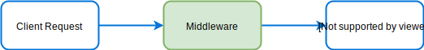
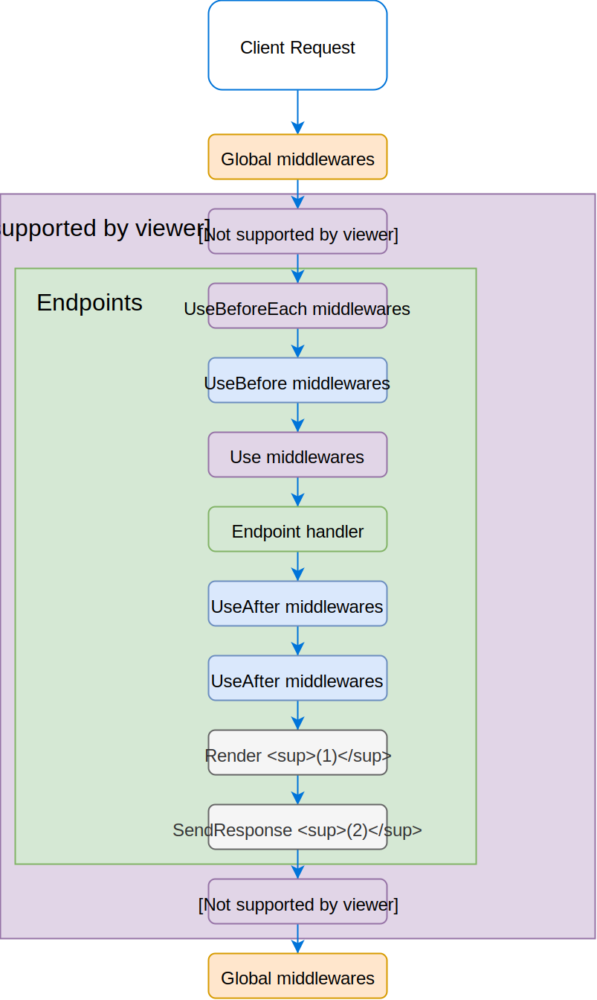

# Middlewares

@@Middleware@@ is similar to the Express middleware with the difference that it's a class and you can use the IoC 
to inject other services on his constructor.

All middlewares decorated by @@Middleware@@ have one method named `use()`. 
This method can use all parameters decorators as you could see with the [Controllers](/docs/controllers.md) and return promise.

<figure></figure>


## Configuration

To begin, you must adding the `middlewares` folder on `componentsScan` attribute in your server settings as follow :

<<< @/docs/docs/snippets/middlewares/server-configuration.ts

Then, create a new file in your middlewares folder. Create a new Class definition then add the @@Middleware@@ decorator.

<<< @/docs/docs/snippets/middlewares/middleware-example.ts

You have differents usecases to declare and use a middleware as following:

 * Global Middleware, this middleware can be used on @@ServerLoader@@,
 * Endpoint Middleware, this middleware can be used on a controller method,
 * Error middleware, this middleware can be use to handle error.
 
::: tip Note
Global middleware and endpoint middleware are similar to one except that the Endpoint middleware 
can retrieve endpoint information that is executed. 
:::

## Global middleware 

Global middleware are generally used handle request before or after controllers. For example the GlobalAcceptMimesMiddleware
is used to check the mime type set in the request headers and throw an error when the mime don't match with server configuration.

<<< @/docs/docs/snippets/middlewares/global-middleware.ts

::: tip 
You can register your global middleware on server level:

<<< @/docs/docs/snippets/middlewares/global-middleware-configuration.ts

:::

## Endpoint middleware 

Endpoint middleware is not really different from global middleware, but his goal is to handle request before or after endpoint.
It know which endpoint is executed by using the @@EndpointInfo@@ decorator. 

<<< @/docs/docs/snippets/middlewares/endpoint-middleware.ts

::: tip
Endpoint middleware must be used on class controller or endpoint method with the following decorators:

- @@UseBefore@@
- @@Use@@
- @@UseAfter@@
- or routes decorators: @@Get@@, @@Post@@, @@Delete@@, @@Put@@ and @@Patch@@

<<< @/docs/docs/snippets/middlewares/endpoint-middleware-usage.ts

:::

## call sequences

As you see in the previous section, a middleware can be use on different context:

- @@ServerLoader@@,
- [Controller](/docs/controllers.md),
- [Endpoint](/docs/controllers.md).

Middleware associated to a controller or endpoint as a same constraint that an endpoint.
It'll be played only when the url request match with the path associated to the controller and his endpoint method.

When a request is sent to the server all middlewares added in the @@ServerLoader@@, [Controller](/docs/controllers.md) or Endpoint with decorators
 will be called while a response isn't sent by one of the handlers/middlewares in the stack.

<figure></figure>

::: tip Note (1) 
Render middleware is called only when a the @@Render@@ decorator is used on the endpoint.
:::

::: tip Note (2) 
SendResponse middleware send a response only when a data is return by the endpoint method or if the endpoint is the latest called endpoint for the resolved route. 
:::

::: tip
The middlewares shown in the Endpoints box will be replayed as many times as it has endpoint that match 
the request url.
:::

::: warning
Only middlewares shown in the Endpoints box can use @@EndpointInfo@@ decorator to retrieve endpoint context execution.
:::

For example:

<<< @/docs/docs/snippets/middlewares/call-sequences.ts

According to the call sequence scheme, the stack calls will be there:

- **Middlewares** added in ServerLoader (logger, express middleware, etc...),
- **MdlwCtrlBefore**,
- **MdlwCtrlBeforeEach**
- **MdlwBefore**,
- **MdlwCtrl**,
- **MyCtrl.endpointA**,
- **MdlwAfter**,
- **SendResponse**, (but nothing data is returned by the endpointA)
- **MdlwCtrlBeforeEach**
- **MdlwCtrl**,
- **MyCtrl.endpointB**,
- **MdlwAfter**,
- **SendResponse**, send a response because endpointB return a data,
- **MdlwCtrlAfter**, but this middleware will not be called because a response is sent.
- **Middleware** added in ServerLoader (not called too).

## Handle error

Express allows you to handle any error when your middleware have 4 parameters like this:

```javascript
function (error, req, res, next){}
```
Ts.ED has the same mechanism with @@Err@@ decorator. The following example is the GlobalErrorHandlerMiddleware
used by Ts.ED to handle all errors throw by your application.


<<< @/docs/docs/snippets/middlewares/global-middleware-error.ts


## Specifics parameters decorators

In addition, you have this specifics parameters decorators for the middlewares:

Signature | Example | Description
--- | --- | --- | ---
@@Err@@ | `useMethod(@Err() err: any) {}` | Inject the `Express.Err` service. (Decorator for middleware).
@@ResponseData@@ | `useMethod(@ResponseData() data: any)` | Provide the data returned by the previous middlewares.
@@EndpointInfo@@ | `useMethod(@EndpointInfo() endpoint: Endpoint)` | Provide the endpoint settings.

## Override existing middlewares

The decorator @@OverrideProvider@@ gives you the ability to override some internal Ts.ED middlewares.

<<< @/docs/docs/snippets/middlewares/override-middleware.ts

Here are some examples to override the middleware provided by Ts.ED:

* [Send response](/docs/middlewares/override/send-response.md)
* [Authentication](/docs/middlewares/override/authentication.md)
* [Response view](/docs/middlewares/override/response-view.md)
* [Global error handler](/docs/middlewares/override/global-error-handler.md)

> All middlewares provided by Ts.ED can be overridden. You can find the complete list [here](/api.md).

::: tip
By default, the server import automatically you middlewares matching with this rules `${rootDir}/middlewares/**/*.ts` (See [componentScan configuration](/configuration.md)).

```
.
├── src
│   ├── controllers
│   ├── services
│   ├── middlewares
│   └── Server.ts
└── package.json
```

If not, just import your middleware in your server or edit the [componentScan configuration](/configuration.md).

```typescript
import {ServerLoader, ServerSettings} from "@tsed/common";
import "./src/other/directory/CustomMiddleware";

@ServerSettings({
    ...
})
export class Server extends ServerLoader {
 
}
```
:::

## Provided middlewares

<ApiList query="symbolType === 'class' && status.indexOf('middleware') > -1" />
