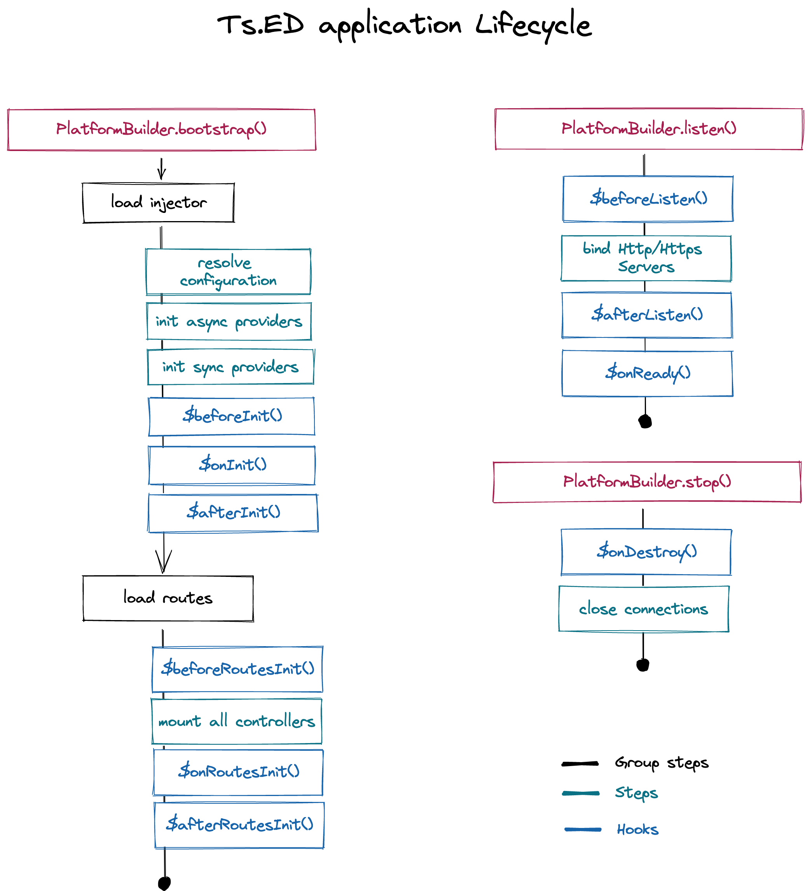

# Services

The decorator `@Service()` declares a new service that can be injected in an other service or controller on their `constructor()`.
All services annotated with `@Service()` are constructed one time.

## Configuration

You must add the `services` folder on `componentsScan` attribute in your server settings as follow :

```typescript
import {Configuration} from "@tsed/di";

@Configuration({
  mount: {
    "/rest": `./controllers/**/**.js`
  },
  componentsScan: [`./services/**/**.js`],
  customServiceOptions: {}
})
export class Server {}
```

## Decorators

<ApiList query="module === '@tsed/di' && symbolType === 'decorator'" />

## Declaring a service

Create a new file in your services folder. Create a new Class definition and add the `@Service()` annotation on your class.

```typescript
import {Configuration, Injectable, Constant, OnInit} from "@tsed/di";
import {BeforeRoutesInit, OnRoutesInit, AfterRoutesInit, OnServerReady} from "@tsed/platform-http";

@Injectable()
export class MyService implements OnInit, BeforeRoutesInit, OnRoutesInit, AfterRoutesInit, OnServerReady {
  @Constant("customServiceOptions", {})
  private settings: any;

  public getSettings() {
    return this.settings;
  }
}
```

Finally, inject the service to another service:

```typescript
import {Injectable} from "@tsed/di";
import {MyService} from "./MyService";

@Injectable()
export class FooService {
  constructor(private myService: MyService) {}
}
```

Or to another controller:

```typescript
import {Controller, Inject} from "@tsed/di";
import {MyService} from "./MyService";

@Controller("/rest")
class MyController {
  @Inject()
  service: MyService;

  // OR from constructor
  constructor(private myService: MyService) {}
}
```

## Override a Service

The decorator @@OverrideProvider@@ gives you the ability to
override some internal Ts.ED service like the @@ParseService@@.

Example usage:

```typescript
import {OverrideProvider} from "@tsed/di";
import {SomeService} from "./SomeService.js";

@OverrideProvider(SomeService)
class CustomService extends SomeService {
  // do something
}
```

## Lifecycle Hooks

Ts.ED 2.x introduces a new Lifecycle Hooks on the service that follows the [Hooks](/docs/hooks.md).
This lifecycle hooks that provide visibility into these key life moments and the ability to act when they occur.

A service that uses one of the phases of the lifecycle can add a number of things and can be completely autonomous.
This is the case with the example of the socket server (See the section [How to integrate Socket.io](/tutorials/socket-io.md)).

These schemes resume the order hooks called by Ts.ED:



Each interface has a single hook method whose name is the interface name prefixed with `$`. For example, the `OnInit`
interface has a hook method named `$onInit()` (old name `$onInjectorReady`) that Ts.ED calls when all services are built.

```typescript
import {Hooks} from "@tsed/core";
import {Injectable, OnInit, Configuration} from "@tsed/di";

@Injectable()
export class MyService implements Hooks, OnInit {
  private settings = {};

  constructor(@Configuration() private configuration: Configuration) {
    this.settings = this.configuration.get<any>("customServiceOptions");
  }

  $onInit(): Promise<any> | void {}

  $beforeRoutesInit(): Promise<any> | void {}

  $afterRoutesInit(): Promise<any> | void {}

  $onReady(): Promise<any> | void {}
}
```

it's also possible to handle `$onDestroy` hook when a service, or a controller is
annotated with `@Scope('request')`:

```typescript
import {Injectable, Scope, OnDestroy} from "@tsed/di";

@Injectable()
@Scope("request")
export class MyService implements OnDestroy {
  $onDestroy() {
    console.log("Service destroyed");
  }
}
```

| Hook               | Purpose and Timing                                                                                                               |
| ------------------ | -------------------------------------------------------------------------------------------------------------------------------- |
| \$onInit           | Respond after Injector has initialized all Services in the registry.                                                             |
| \$beforeRoutesInit | Respond before loading the controllers. The middlewares and filters are already built.                                           |
| \$afterRoutesInit  | Respond after the controllers build.                                                                                             |
| \$onReady          | Respond when the server is ready. At this step, Http.Server or/and Https.Server object is available. The server listen the port. |
| \$onDestroy        | Respond when a Service or Controller is destroyed (uniquely when class is annotated with `@Scope('request')`.                    |

::: tip Interfaces are optionals

The interfaces are optionals for JavaScript and Typescript developers from a purely technical perspective.
The JavaScript language doesn't have interfaces. Ts.ED can't see TypeScript interfaces at runtime because they disappear from the transpiled JavaScript.

Nonetheless, it's good practice adding interfaces to TypeScript directive classes in order to benefit from strong typing and editor tooling.
:::
