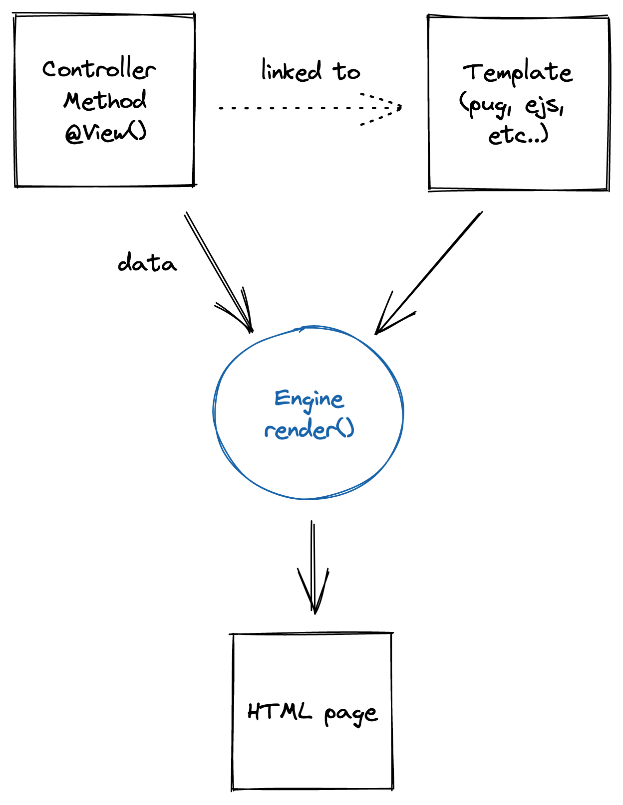

---
meta:
  - name: description
    content: Use template engine with Ts.ED by using decorators. Ts.ED is built on top of Express/Koa and uses TypeScript language.
  - name: keywords
    content: template engine tsed-engines ts.ed express typescript node.js javascript decorators
---

# Templating

@@View@@ is a decorator which can be used on a controller method (endpoint).
This decorator will use the data returned by the method, and the configured view to create the response.

<figure></figure>

## Configuration

Install the Ts.ED engines:

<Tabs class="-code">
  <Tab label="Yarn">

```bash
$ yarn add @tsed/engines
```

  </Tab>
  <Tab label="Npm">

```bash
$ npm install --save @tsed/engines
```

  </Tab>
</Tabs>

The default template engine installed with Ts.ED is [EJS](https://ejs.co/).

<<< @/docs/snippets/templating/configuration.ts

::: tip
Supported engines is available [here](https://github.com/tsedio/tsed-engines/blob/production/packages/engines/readme.md#supported-template-engines).
:::

## Options

```typescript
export interface PlatformViewsSettings {
  /**
   * Views directory.
   */
  root?: string;
  /**
   * Enable cache. Ts.ED enables cache in PRODUCTION profile by default.
   */
  cache?: boolean;
  /**
   * Provide extensions mapping to match the expected engines.
   */
  extensions?: Partial<PlatformViewsExtensionsTypes>;
  /**
   * Default view engine extension.
   * Allow omitting extension when using View decorator or render method.
   */
  viewEngine?: string;
  /**
   * Options mapping for each engine.
   */
  options?: Partial<PlatformViewsEngineOptions>;
}
```

## Supported template engines

Some package has the same key name, `@tsed/engines` will load them according to the order number.
For example with dust, @tsed/engines will try to use in this order: `dustjs-helpers` and `dustjs-linkedin`.
If `dustjs-helpers` is installed, `dustjs-linkedin` will not be used by consolidate.

| Name                                                      | Package Name / Order                                                                                                                                                      | Website / State                                                       |
| --------------------------------------------------------- | ------------------------------------------------------------------------------------------------------------------------------------------------------------------------- | --------------------------------------------------------------------- |
| [atpl](https://github.com/soywiz/atpl.js)                 | [`npm install atpl`](https://www.npmjs.com/package/atpl)                                                                                                                  | -                                                                     |
| [bracket](https://github.com/danlevan/bracket-template)   | [`npm install bracket-template`](https://www.npmjs.com/package/bracket-template)                                                                                          | -                                                                     |
| [dot](https://github.com/olado/doT)                       | [`npm install dot`](https://www.npmjs.com/package/dot)                                                                                                                    | [(website)](http://olado.github.io/doT/)                              |
| [dust](https://github.com/linkedin/dustjs)                | [`npm install dustjs-helpers`](https://www.npmjs.com/package/dustjs-helpers) (2) or<br>[`npm install dustjs-linkedin`](https://www.npmjs.com/package/dustjs-linkedin) (3) | [(website)](http://linkedin.github.io/dustjs/)                        |
| [ect](https://github.com/baryshev/ect)                    | [`npm install ect`](https://www.npmjs.com/package/ect)                                                                                                                    | [(website)](http://ectjs.com/)                                        |
| [ejs](https://github.com/mde/ejs)                         | [`npm install ejs`](https://www.npmjs.com/package/ejs)                                                                                                                    | [(website)](http://ejs.co/)                                           |
| [hamlet](https://github.com/gregwebs/hamlet.js)           | [`npm install hamlet`](https://www.npmjs.com/package/hamlet)                                                                                                              | -                                                                     |
| [hamljs](https://github.com/visionmedia/haml.js)          | [`npm install hamljs`](https://www.npmjs.com/package/hamljs)                                                                                                              | -                                                                     |
| [haml-coffee](https://github.com/netzpirat/haml-coffee)   | [`npm install haml-coffee`](https://www.npmjs.com/package/haml-coffee)                                                                                                    | -                                                                     |
| [handlebars](https://github.com/wycats/handlebars.js/)    | [`npm install handlebars`](https://www.npmjs.com/package/handlebars)                                                                                                      | [(website)](http://handlebarsjs.com/)                                 |
| [hogan](https://github.com/twitter/hogan.js)              | [`npm install hogan.js`](https://www.npmjs.com/package/hogan.js)                                                                                                          | [(website)](http://twitter.github.com/hogan.js/)                      |
| [htmling](https://github.com/codemix/htmling)             | [`npm install htmling`](https://www.npmjs.com/package/htmling)                                                                                                            | -                                                                     |
| [jazz](https://github.com/shinetech/jazz)                 | [`npm install jazz`](https://www.npmjs.com/package/jazz)                                                                                                                  | -                                                                     |
| [just](https://github.com/baryshev/just)                  | [`npm install just`](https://www.npmjs.com/package/just)                                                                                                                  | -                                                                     |
| [liquor](https://github.com/chjj/liquor)                  | [`npm install liquor`](https://www.npmjs.com/package/liquor)                                                                                                              | -                                                                     |
| [lodash](https://github.com/bestiejs/lodash)              | [`npm install lodash`](https://www.npmjs.com/package/lodash)                                                                                                              | [(website)](http://lodash.com/)                                       |
| [marko](https://github.com/marko-js/marko)                | [`npm install marko`](https://www.npmjs.com/package/marko)                                                                                                                | [(website)](http://markojs.com)                                       |
| [mote](https://github.com/satchmorun/mote)                | [`npm install mote`](https://www.npmjs.com/package/mote)                                                                                                                  | [(website)](http://satchmorun.github.io/mote/)                        |
| [mustache](https://github.com/janl/mustache.js)           | [`npm install mustache`](https://www.npmjs.com/package/mustache)                                                                                                          | -                                                                     |
| [nunjucks](https://github.com/mozilla/nunjucks)           | [`npm install nunjucks`](https://www.npmjs.com/package/nunjucks)                                                                                                          | [(website)](https://mozilla.github.io/nunjucks)                       |
| [plates](https://github.com/flatiron/plates)              | [`npm install plates`](https://www.npmjs.com/package/plates)                                                                                                              | -                                                                     |
| [pug](https://github.com/pugjs/pug)                       | [`npm install pug`](https://www.npmjs.com/package/pug)                                                                                                                    | [(website)](http://jade-lang.com/) / **(formerly jade)**              |
| [ractive](https://github.com/ractivejs/ractive)           | [`npm install ractive`](https://www.npmjs.com/package/ractive)                                                                                                            | -                                                                     |
| [react](https://github.com/facebook/react)                | [`npm install react`](https://www.npmjs.com/package/react)                                                                                                                | -                                                                     |
| [slm](https://github.com/slm-lang/slm)                    | [`npm install slm`](https://www.npmjs.com/package/slm)                                                                                                                    | -                                                                     |
| [squirrelly](https://github.com/squirrellyjs/squirrelly)  | [`npm install squirrelly`](https://www.npmjs.com/package/squirrelly)                                                                                                      | [(website)](https://squirrelly.js.org)                                |
| [swig](https://github.com/node-swig/swig-templates)       | [`npm install swig-templates`](https://www.npmjs.com/package/swig-templates) (2)                                                                                          | -                                                                     |
| [teacup](https://github.com/goodeggs/teacup)              | [`npm install teacup`](https://www.npmjs.com/package/teacup)                                                                                                              | -                                                                     |
| [templayed](https://github.com/archan937/templayed.js/)   | [`npm install templayed`](https://www.npmjs.com/package/templayed)                                                                                                        | [(website)](http://archan937.github.com/templayed.js/)                |
| [toffee](https://github.com/malgorithms/toffee)           | [`npm install toffee`](https://www.npmjs.com/package/toffee)                                                                                                              | -                                                                     |
| [twig](https://github.com/justjohn/twig.js)               | [`npm install twig`](https://www.npmjs.com/package/twig)                                                                                                                  | [(wiki)](https://github.com/twigjs/twig.js/wiki/Implementation-Notes) |
| [twing](https://github.com/NightlyCommit/twing)           | [`npm install twing`](https://www.npmjs.com/package/twing)                                                                                                                | [(website)](https://nightlycommit.github.io/twing/)                   |
| [underscore](https://github.com/documentcloud/underscore) | [`npm install underscore`](https://www.npmjs.com/package/underscore)                                                                                                      | [(website)](http://underscorejs.org/#template)                        |
| [vash](https://github.com/kirbysayshi/vash)               | [`npm install vash`](https://www.npmjs.com/package/vash)                                                                                                                  | -                                                                     |
| [velocityjs](https://github.com/julianshapiro/velocity)   | [BETA](https://www.npmjs.com/package/velocity-animate)                                                                                                                    | [(website)](http://velocityjs.org/)                                   |
| [walrus](https://github.com/jeremyruppel/walrus)          | [`npm install walrus`](https://www.npmjs.com/package/walrus)                                                                                                              | [(website)](http://documentup.com/jeremyruppel/walrus/)               |
| [whiskers](https://github.com/gsf/whiskers.js)            | [`npm install whiskers`](https://www.npmjs.com/package/whiskers)                                                                                                          | -                                                                     |

::: tip Note
You must still install the engines you wish to use, add them to your package.json dependencies.
:::

## Usage

### Template Engine Instances

Template engines are exposed via the `requires` Map, but they are not instantiated until you've called the `getEngine(engine).render()` method.
You can instantiate them manually beforehand if you want to add filters, globals, mixins, or other engine features.

::: tip Reference
[Template Engine Instances](https://github.com/tsedio/tsed-engines/blob/production/packages/engines/readme.md#template-engine-instances).
:::

### Nunjucks

```typescript
import {Configuration} from "@tsed/common";
import nunjucks from "nunjucks";

const nunjucksInstances = nunjucks.configure("./views");
nunjucksInstances.addFilter("foo", function () {
  return "bar";
});

@Configuration({
  views: {
    root: `${rootDir}/views`,
    viewEngine: "nunjucks",
    extensions: {
      njk: "nunjucks"
    },
    options: {
      nunjucks: {
        requires: nunjucksInstances
      }
    }
  }
})
export default class ShopApp {}
```

### With decorator

Here is an example of a controller using the @@View@@ decorator:

<Tabs class="-code">
  <Tab label="EventCtrl.ts">

<<< @/docs/snippets/templating/response-templating.ts

  </Tab>
  <Tab label="event.ejs">

```html
<h1><%- name %></h1>
<div>Start: <%- startDate %></div>
```

  </Tab>
</Tabs>

::: tip

Like Express.js or Koa.js, @@View@@ decorator uses `express.response.locals` or `koa.context.state` to populate data before
rendering the template. See [Locals](/docs/controllers.html#locals) decorator usage for more information.

:::

### With render method

It's also possible to render a view by injecting and using @@PlatformResponse@@ instance.

<Tabs class="-code">
  <Tab label="EventCtrl.ts">

<<< @/docs/snippets/templating/template-platform-api.ts

  </Tab>
  <Tab label="event.ejs">

```html
<h1><%- name %></h1>
<div>Start: <%- startDate %></div>
```

  </Tab>
</Tabs>

### With PlatformViews

Ts.ED provides the @@PlatformViews@@ service to render views. In fact, @@View@@ decorator
uses `PlatformResponse.render()` method which itself uses the `PlatformViews.render()` method.
It is useful if you want to render a template from a service.

<<< @/docs/snippets/templating/template-platform-views.ts

## Alter render options

You can alter the render options before rendering the view. Listen the `$alterRenderOptions` hook to inject
data:

```typescript
import {Injectable, DIContext} from "@tsed/di";

@Injectable()
class AlterOptions {
  async $alterRenderOptions(options: Record<string, any>, $ctx: DIContext) {
    // only called when the response.render is called by your code
    options.alter = "alter";
    return options;
  }
}
```

## Caching

To enable caching, simply pass `{ cache: true }` to the @@View@@ decorator.
All engines that `consolidate.js` / [`@tsed/engines`](https://github.com/tsedio/tsed-engines) implements I/O for, will
cache the file contents, ideal for production environments.

<<< @/docs/snippets/templating/template-cache.ts

::: tip
Ts.ED enables cache by default in `PRODUCTION` profile.
:::

## Implement your own engine

`@tsed/engines` let you register your own engine by using the `@ViewEngine` decorator. Here an is example of
pug engine implementation:

```typescript
import {Engine, ViewEngine} from "@tsed/engines";

@ViewEngine("pug", {
  requires: ["pug", "then-pug"] // multiple require is possible. Ts.ED will use the first module resolved from node_modules
})
export class PugEngine extends Engine {
  protected $compile(template: string, options: any) {
    return this.engine.compile(template, options);
  }

  protected async $compileFile(file: string, options: any) {
    return this.engine.compileFile(file, options);
  }
}
```
