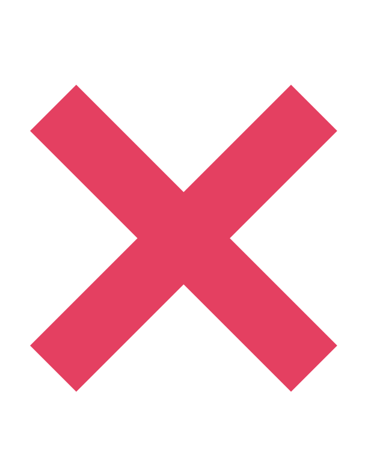

# Introduction

Ts.ED is a framework for building server-side and scalable applications for Node.js environment. It's built with [TypeScript](http://www.typescriptlang.org/) and uses classes (OOP), decorators and Functional programming
to develop your application.

It uses [Express.js](https://expressjs.com/) HTTP server frameworks by default, but it's also possible to use [Koa.js](https://koajs.com) or [Serverless](https://www.serverless.com/) as well.

Ts.ED provides a level of abstraction above these common Node.js frameworks (Express/Koa) with the [Platform API](/docs/platform-api.md)
but also exposes their APIs directly for the developer. It gives developers the freedom to use the myriad of third-party
node modules which are available for the underlying platform.

## Philosophy

Node.js opened the possibility of making server applications with Javascript, allowing to pool front-end and back-end skills.

With this we have seen the birth of extraordinary projects like [React.js](https://reactjs.org/), [Vue.js](https://vuejs.org/), [Angular](https://angular.io).
Each of these projects bring their vision of a web application, but we have the same wish, to make the developer's life easier by providing
all the right tools to developers so that they are quickly productive.

Ts.ED tends towards the same objective which is to achieve better productivity while remaining easy to understand.
To achieve this, Ts.ED provides out-of-the-box an application architecture, highly testable, scalable and maintainable.

## Platform features support

Here are the features list provided by Ts.ED and the compatibility with the different platforms:

<div class="table-features">

| Features                                                                                                                                                                                            | Express.js                                            | Koa.js                                                | [Serverless λ](/tutorials/serverless.md)               | [CLI](/docs/command.md)                                |
| --------------------------------------------------------------------------------------------------------------------------------------------------------------------------------------------------- | ----------------------------------------------------- | ----------------------------------------------------- | ------------------------------------------------------ | ------------------------------------------------------ |
| [Controllers](/docs/controllers.md) <br /> <small>([routing](/docs/controllers.md), [nested](/docs/controllers.html#nested-controllers), [inheritance](/docs/controllers.html#inheritance))</small> |  |  |   |  |
| [Providers](/docs/providers.md)                                                                                                                                                                     |  |  |   |   |
| [Model & JsonSchema](/docs/model.md)                                                                                                                                                                |  |  |   |   |
| [JsonMapper](/docs/json-mapper.md)                                                                                                                                                                  |  |  |   |   |
| [Middlewares](/docs/middlewares.md)                                                                                                                                                                 |  |  |  |  |
| [Pipes](/docs/pipes.md)                                                                                                                                                                             |  |  |   |  |
| [Interceptors](/docs/interceptors.md)                                                                                                                                                                  |  |  |   |   |
| [Authentication](/docs/authentication.md)                                                                                                                                                         |  |  |  |  |
| [Hooks](/docs/hooks.md)                                                                                                                                                                             |  |  |   |   |
| [Exceptions](/docs/exceptions.md)                                                                                                                                                                   |  |  |   |  |
| [Logger](/docs/logger.md)                                                                                                                                                                           |  |  |   |   |
| [Upload files](/docs/upload-files.md)                                                                                                                                                               |  |  |  |  |
| [Serve files](/docs/serve-files.md)                                                                                                                                                                 |  |  |  |  |
| [Templating](/docs/templating.md)                                                                                                                                                                   |  |  |   |  |
| [Validation](/docs/validation.md)                                                                                                                                                                   |  |  |   |  |
| [Response Filters](/docs/response-filter.md)                                                                                                                                                        |  |  |   |  |
| [Cache](/docs/cache.md)                                                                                                                                                                             |  |  | <center>?</center>                                     |  |

</div>

## Platform plugins support

Here are the plugins provided by Ts.ED and the compatibility with the different platforms:

<div class="table-features">

| Features                                  | Express.js                                            | Koa.js                                                 | [Serverless λ](/tutorials/serverless.md)               | [CLI](/docs/command.md)                                |
| ----------------------------------------- | ----------------------------------------------------- | ------------------------------------------------------ | ------------------------------------------------------ | ------------------------------------------------------ |
| [Passport.js](/tutorials/passport.html)   |  |  |  |  |
| [Prisma](/tutorials/prisma.html)          |  |   |   |   |
| [TypeORM](/tutorials/typeorm.html)        |  |   |   |   |
| [Mongoose](/tutorials/mongoose.html)      |  |   |   |   |
| [IORedis](/tutorials/ioredis.html)        |  |   |   |   |
| [Objection.js](/tutorials/objection.html) |  |   |   |   |
| [GraphQL](/tutorials/graphql.html)        |  |    |  |  |
| [Socket.io](/tutorials/socket-io.html)    |  |   |  |  |
| [Swagger](/tutorials/swagger.html)        |  |   |  |  |
| [OIDC](/tutorials/oidc.html)              |  |   |  |  |
| [Stripe](/tutorials/stripe.html)          |  |   | <center>?</center>                                     |  |

</div>

## Installation

To get started, you can either scaffold the project with the Ts.ED CLI, or clone a starter project.

To scaffold the project with the CLI, run the following commands. This will create a new project directory,
and populate the directory with the initial core Ts.ED files and supporting modules, creating a conventional base structure for your project.
Creating a new project with the CLI is recommended for first-time users.

```shell
npm install -g @tsed/cli@4.0.0-rc.2
tsed init .
```

By using the CLI, you will be able to choose between different options to generate your first application:

- The web framework: Express.js / Koa.js
- The convention project architecture: Ts.ED or Feature
- The convention file styling: Ts.ED or Angular
- The features:
  - Graphql,
  - Database,
  - Passport.js,
  - Socket.io,
  - Swagger,
  - OIDC,
  - Testing (Jest/Mocha),
  - Linter (Eslint, prettier),
  - Bundler (Babel/Webpack),
- The Package manager: NPM, Yarn or PNPM

::: tip
By default, it's recommended to select the following options: Express, Ts.ED (convention), Swagger, Jest and Eslint + prettier.
:::

<figure></figure>

When all options are selected, the CLI will generate all files.
When it's done, run one of this command:

```sh
yarn start
npm start
pnpm start
```

<figure></figure>

## Update dependencies

::: warning
If you have to upgrade Ts.ED dependencies, keep in mind this point:

It's really important to keep the same version for all `@tsed/*` (excepted @tsed/logger) packages.
To prevent errors, fix the version for each Ts.ED packages:

```json
{
  "dependencies": {
    "@tsed/common": "6.10.0",
    "@tsed/di": "6.10.0",
    "@tsed/core": "6.10.0",
    "@tsed/exceptions": "6.10.0",
    "@tsed/plaftorm-express": "6.10.0",
    "@tsed/swagger": "6.10.0"
  }
}
```

:::

## Project examples

Alternatively, you can check out one of these projects:

<Projects type="projects" />

If none of previous solutions are satisfying maybe you are in these cases:

- [I want to migrate my application from Ts.ED v6](/getting-started/migration-from-v6.md)
- [I want to migrate my application from Express.js](/getting-started/migrate-from-express.md)

## What's next?

Now you can follow one of these links to develop your new application:

- [Create your first controller](/getting-started/create-your-first-controller.md)
- [Change server configuration](/docs/configuration.md)
- [Load configuration from files](/docs/configuration.md)
- [What is the Platform API](/docs/platform-api.md)
