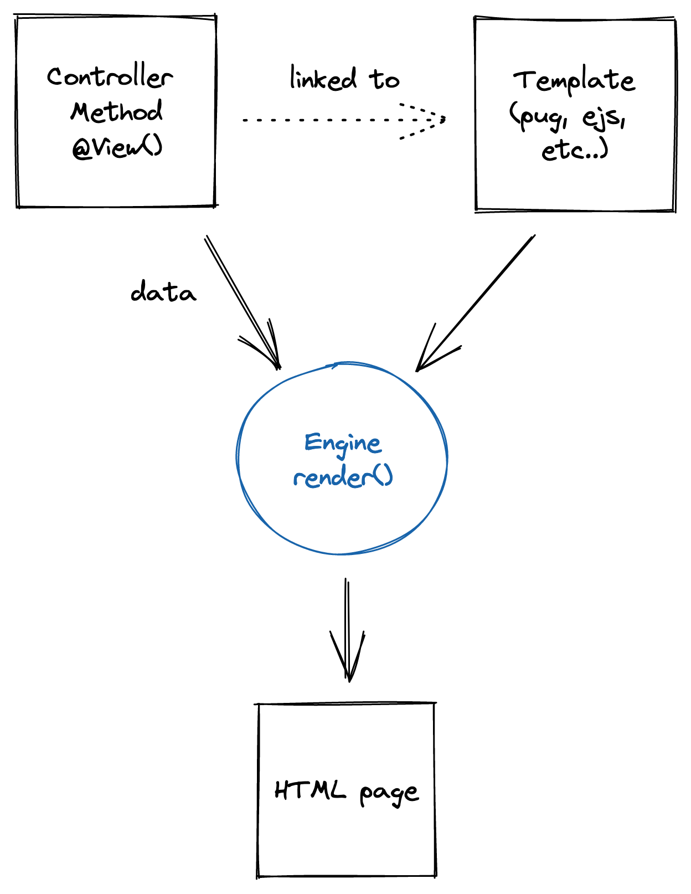

# Templating

@@Render@@ is a decorator which can be used on a controller method (endpoint).
This decorator will use the response returned by the method and will use the view to create the output.

<figure></figure>

## Installation

This example uses [EJS](https://ejs.co/) and [consolidate](https://npmjs.com/package/consolidate). 
To use an other engine, see the documentation of the concerned project. 

<Tabs class="-code">
  <Tab label="v5.56.0+">
  
<<< @/docs/tutorials/snippets/templating/configuration.ts

  </Tab>
  <Tab label="Legacy">
    
<<< @/docs/tutorials/snippets/templating/configuration-legacy.ts
  
  </Tab>
</Tabs>  

::: tip 
The configuration engine is exactly the same as Express configuration engine. 
:::

## Usage

A template engine like [EJS](https://ejs.co/) or [Handlebars](https://handlebarsjs.com/) can be used to change the response returned by your endpoint.
Like Express.js, you need to configure the templating engine so that you can use it later with the @@Render@@ decorator.

Here is an example of a controller using the @@Render@@ decorator:

<<< @/docs/docs/snippets/controllers/response-templating.ts

And its view:
```html
<h1><%- name %></h1>
<div>
    Start: <%- startDate %>
</div>
```
